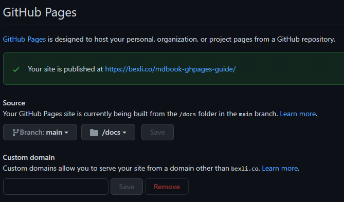

# Setting up your GitHub Repo
> Don't worry if you already have one set up. If this is the case, delete and untrack your book dir and skip 1 - 2

1. Create your repo on GitHub
2. Set your local repo's remote to your new GitHub repo 
3. Settings > Pages > Source
   1. Set branch to `master`/`main`
   2. Specify `/docs` folder

|                 Github Pages Settings                 |
| :---------------------------------------------------: |
|  |